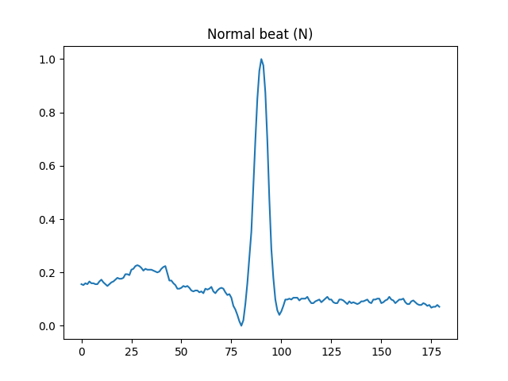
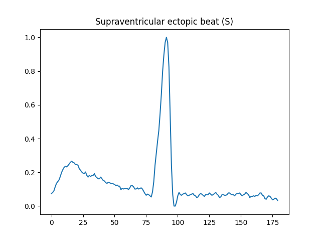
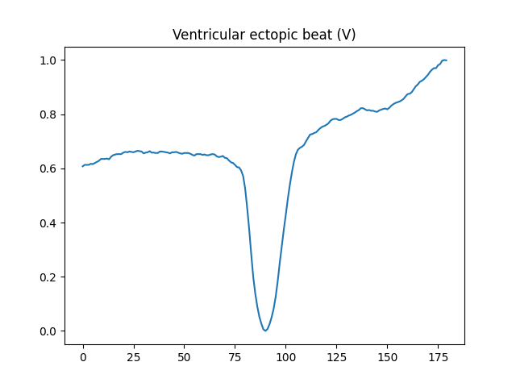
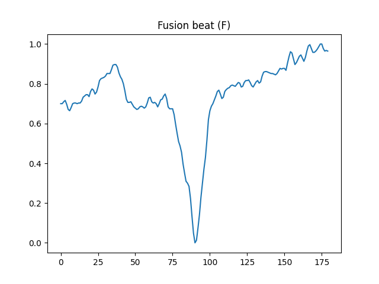
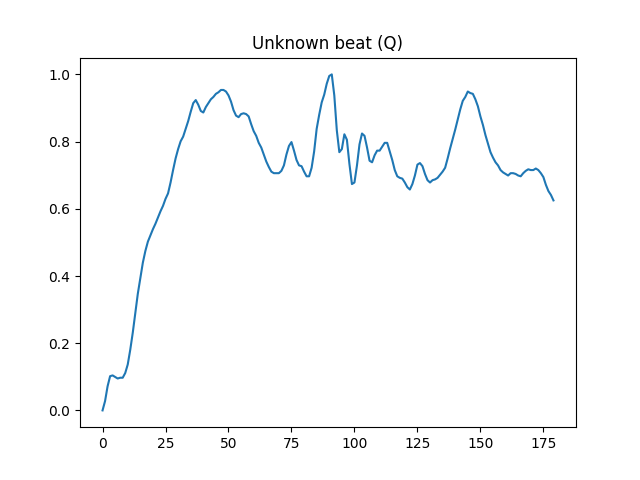

# EKG osztályozó

A projekt GitHub linkje: https://github.com/martinkovacs/ecg-classifier

## Bevezetés
Az elektrokardiogram (EKG) a szív elektromos tevékenységének grafikonja, amely létfontosságú diagnosztikai eszköz a modern kórházi ellátásban. Az EKG segítségével orvosok sok fontos információt nyerhetnek a szív állapotáról, beleértve a szívritmus, a szívizom károsodás és az ingerületvezető rendszer abnormalitásainak felismerését. Az EKG-jelek pontos elemzése és osztályozása elengedhetetlen a szívbetegségek korai felismeréséhez és a megfelelő kezelés meghatározásához.

Hagyományosan az EKG-k értelmezése manuálisan, képzett orvosok által történik, ami időigényes és szubjektív folyamat. A mesterséges intelligencián alapuló megközelítések rendkívül hatékonyak az EKG-k osztályozásában, mivel a neurális hálózatok megtanulhatják a komplex, nemlineáris jellegzetességeket az adatokból anélkül, hogy az emberi szakértők által meghatározott szabályokra kellene hagyatkozniuk.

Ez a projekt egy neurális hálózat alapú EKG osztályozó rendszert mutat be, amely a PyTorch keretrendszerre épül. A rendszer képes különböző szívritmus rendellenességek automatikus azonosítására és osztályozására az EKG jelekből.

<br />

## Adathalmaz
A projekt az [MIT-BIH Arrhythmia Database](https://physionet.org/content/mitdb/1.0.0/) felhasználásával készült. Ez az adatbázis 48 darab, nagyjából 30 perces felvételt tartalmaz. A felvételek két mellkasi elektródával készültek (MLII, V1 / V2 / V4 / V5). Ezeket az analóg felvételeket később 360Hz-en digitalizálták. A szívverés jelölése az ütés közepén (a QRS-komplex csúcsán) került feltüntetésre.

Az adatok waveform-database formában lettek közzétéve, ezért szükséges adatokat .csv formátumra konvertálni. Ez egyszerűen a `convert-dataset.py` kód futtatásával történik meg.  A kód beolvassa az adatfájlokat a `wfdb` könyvtár segítségével, és kinyeri a szívritmusokat az MLII jelből. Minden egyes szívritmus esetében a kód 180 mintavételi pontot (90-et a csúcs előtt és 90-et utána) választ ki, ami a 360Hz-es mintavétel miatt ~500ms-nak felel meg. Az értékek normalizálásra kerülnek \[0, 1\] tartományon.

Ezután meghatározza az EKG annotációk csoportjait, amelyeket a modell tanulás során használni fog. Ezek az annotációk az alábbi [táblázat](https://www.ncbi.nlm.nih.gov/pmc/articles/PMC4897569/table/tab1/?report=objectonly) szerint kerülnek csoportosításra, amik a következők:
- Normál szívverés (N)
- Supraventrikuláris (pitvarokból eredő) rendellenes szívverés (S)
- Ventrikuláris (kamrákból eredő) rendellenes szívverés (V)
- Fúziós verés (normál és rendellenes ingerület egybeesik) (F)
- Ismeretlen eredetű szívverés (Q)

A csoportok \[0, 4\] intervallumon kaptak értéket, amivel egyszerűen létrehozható a one-hot kódolás a tanításhoz.

A kiválasztott szívritmus mintákat az osztállyal együtt egy listába menti. A lista minden eleme egy 181 elemű tömb, amely a 180 mintavételi pontot és az osztályt tartalmazza. Ez a lista kerül 4:1 arányban felosztásra train és test adathalmazra. A pandas könyvtár segítségével kerülnek .csv fájlként elmentésre.

| Példák a szívverésekre                                                                    |                                                                                               |
| ----------------------------------------------------------------------------------------- | --------------------------------------------------------------------------------------------- |
|                                                                     |                                                                         |
| Normál szívverés (N)<br>`mitbih_test.csv`, index: 0                                        | Supraventrikuláris (pitvarokból eredő) rendellenes szívverés<br>`mitbih_test.csv`, index: 88   |
|                                                                     |                                                                         |
| Ventrikuláris (kamrákból eredő) rendellenes szívverés (V)<br>`mitbih_test.csv`, index: 381 | Fúziós verés (normál és rendellenes ingerület egybeesik) (F)<br>`mitbih_test.csv`, index: 2796 |
|                                                                     |                                                                                               |
| Ismeretlen eredetű szívverés (Q)<br>`mitbih_test.csv`, index: 1613                         |                                                                                               |

<br />

## Architektúra

#### Modell
```python title:train.py
class ECGClassifier(torch.nn.Module):
    def __init__(self) -> None:
        super().__init__()
        self.layers = torch.nn.Sequential(
            torch.nn.Linear(180, 128),
            torch.nn.ReLU(),
            torch.nn.Linear(128, 64),
            torch.nn.ReLU(),
            torch.nn.Linear(64, 5)
        )

    def forward(self, x):
        return self.layers(x)
```

Ez a neurális hálózat egy PyTorch alapú implementáció, amely a `torch.nn.Module` osztályból származik. Ez lehetővé teszi a modell definiálását és betanítását a PyTorch keretrendszeren belül. A `__init__` függvény a modell rétegeinek inicializálását végzi, egy teljes összekötött neurális hálózatot definiálva.

A modell architektúrája három lineáris réteget és két ReLU (Rectified Linear Unit) aktivációs függvényt tartalmaz. Az első lineáris réteg 180 bemeneti adatot vár, és 128-at ad ki. A második lineáris réteg a 128 adatot 64-re csökkenti, míg a harmadik lineáris réteg az 5 kimeneti osztályt határozza meg. Az aktivációs függvények nem linearitást vezetnek be a modellbe, ami fontos a mintázatok felismerése érdekében.

A `forward` függvény határozza meg a modell előrecsatolását, vagyis azt a folyamatot, amellyel a bemeneti adatokból az előrejelzések származnak. Ebben az esetben a forward függvény egyszerűen az x bemenetet továbbítja a self.layers változóban lévő szekvenciális modulon keresztül, amely a definiált lineáris rétegek és aktivációs függvények sorozatát hajtja végre. Ez a kimeneti érték lesz az 5 osztály valószínűségi értékeinek vektora.

#### Tanítás
```python title:train.py
def train(dataset_path: str = "dataset/mitbih_train.csv", model_path: str = "models/model.pt", epochs: int = 4000) -> None:
    data = pd.read_csv(dataset_path, header=None, dtype=np.float32)
    results = data.iloc[:, -1]
    data.drop(data.columns[-1], axis=1, inplace=True)
    
    X_train = torch.tensor(data.values, dtype=torch.float32)
    y_train = torch.nn.functional.one_hot(torch.tensor(results.values, dtype=torch.long)).to(torch.float32)
    
    model = ECGClassifier()
    
    criterion = torch.nn.CrossEntropyLoss()
    optimizer = torch.optim.Adam(model.parameters())
    
    model.train()
    for epoch in range(epochs):
        outputs = model(X_train)
        loss = criterion(outputs, y_train)
        
        optimizer.zero_grad()
        loss.backward()
        optimizer.step()
        
        if epoch % 100 == 0:
            print(f"Epoch [{epoch}/{epochs}], Loss: {loss}")
    
    torch.save(model.state_dict(), model_path)
```

A kód első lépése az adatok betöltése a pandas könyvtár segítségével. A mitbih_train.csv fájl fejléc nélküli, lebegőpontos adatokat tartalmaz. Az adatok utolsó oszlopa az eredményeket tartalmazza, míg a többi oszlop az EKG jeleket tartalmazza.

Az eredményeket one-hot kódolással alakítjuk át, ami azt jelenti, hogy minden cél egy bináris vektort kap, ahol a megfelelő osztályt 1, a többi osztályt pedig 0 jelöli. Ez a lépés szükséges ahhoz, hogy a neurális hálózat képes legyen kezelni a többosztályos osztályozási problémát.

A következő lépés az `ECGClassifier` neurális hálózat modell példányosítása. Ez a modell a korábban bemutatott architektúrát követi, amely három lineáris réteget és két ReLU aktivációs függvényt tartalmaz. A kód ezután definiálja a veszteségfüggvényt (`CrossEntropyLoss`) és az optimalizálót (`Adam`). A `CrossEntropyLoss` veszteségfüggvény alkalmas a többosztályos osztályozási problémákra, míg az `Adam` optimalizáló a modell paramétereinek hatékony frissítését végzi a gradiens alapján. A modell `train()` módszerével átállítjuk a modellt tanuló módba.

A betanítási ciklus a megadott `epochs` számú iteráción keresztül fut. Minden iterációban a kód először kiszámítja a modell kimeneti értékeit az `X_train` bemenetre. Ezt követően kiszámítja a veszteséget a valós `y_train` célokhoz képest, a korábban definiált `CrossEntropyLoss` veszteségfüggvény segítségével. A veszteség értéke azt mutatja, hogy a modell mennyire tér el a valós célértékektől, és ezt az értéket minimalizálni kell a betanítás során.

Minden epochban előrehaladva a modell előrejelzéseket ad a betanító adatokra, kiszámítja a veszteséget, visszaterjeszti a veszteséget a modell paramétereinek finomhangolásához, majd frissíti a modell paramétereit az optimalizáló lépéssel. A veszteség értékét 100 epochonként kinyomtatja a konzolra, így nyomon követhető a modell tanulásának az előrehaladása.

#### Tesztelés
```python title:test.py
def test(dataset_path: str = "dataset/mitbih_test.csv", model_path: str = "models/model.pt") -> None:
    model = ECGClassifier()
    model.load_state_dict(torch.load(model_path))
    model.eval()
    
    test_data = pd.read_csv(dataset_path, header=None, dtype=np.float32)
    test_results = test_data.iloc[:, -1]
    test_data.drop(test_data.columns[-1], axis=1, inplace=True)
    
    with torch.inference_mode():
        pred = torch.nn.functional.softmax(model(torch.tensor(test_data.values, dtype=torch.float32)), dim=1)
    
        correct = [0, 0, 0, 0, 0]
        total = [0, 0, 0, 0, 0]
        for idx, p in enumerate(pred):
            if int(torch.max(p, 0).indices.item()) == int(test_results[idx]):
                correct[int(test_results[idx])] += 1
            total[int(test_results[idx])] += 1
        
        print(sum(correct), len(pred), sum(correct) / len(pred))
        print([c / t for c, t in zip(correct, total)])
        print([(c, t) for c, t in zip(correct, total)])
```

A kód első lépésként betölti a modellt a megadott elérési útról, majd értékelésre állítja. Ezután beolvassa a tesztadatot egy CSV fájlból, amely EKG jeleket és azok eredményeit tartalmazza.

A következő lépésben a kód elkülöníti a tesztadatok utolsó oszlopát, amely a eredményeket tartalmazza, majd pedig eltávolítja ezt az oszlopot az adatokból. Ezután a modellt alkalmazza a tesztadatokra, és a modell kimeneteire alkalmazza a `softmax` függvényt, amely valószínűségi eloszlást ad vissza a különböző osztályokra.

A kód ezután végigmegy az előrejelzések listáján, és összehasonlítja azokat a valódi értékekkel. Ha az előrejelzett osztály megegyezik a valódi címkével, akkor a kód növeli a megfelelő osztály helyes előrejelzéseinek számát. Emellett a kód nyomon követi az összes előrejelzés számát is minden osztályra.

Végül a kód kiírja a teljes pontosságot, amely a helyes előrejelzések számának és az összes előrejelzés számának hányadosa. Ezenkívül kiírja az egyes osztályok pontosságát is, amelyet az osztály helyes előrejelzéseinek számának és az osztályra vonatkozó összes előrejelzés számának hányadosaként számít ki. A kód utolsó sora a helyes és összes előrejelzések számát írja ki egy listában, osztályonként.

<br />

## Eredmény
A modell sikerességét kétféle módon is lehet mérni. Az egyik a legmagasabb pontosság, tehát a tesztadathalmaz egészét hány százalékos pontossággal találta el. A másik módszer pedig a legmagasabb minimum osztálypontosság. Ez azt jelenti, hogy az a modellt tekintjük jobbnak, ahol a legrosszabb pontosságú osztály pontossága magasabb. Mindkét értékelési módszer hasznos lehet a szituációtól függően, így mindkét módszernél a legjobban teljesítő modell elmentésre került. A tesztadathalmaz (`dataset/mitbih_test.csv`) 21018 sort tartalmaz, és ezen kerültek kiértékelésre.

#### Legmagasabb pontosság
A legmagasabb pontosságú modellt a `models/model-9912.pt` fájl tartalmazza. Összpontossága 99,12%

```
20832 21018 0.9911504424778761
[0.99817336, 0.85792350, 0.97547684, 0.79503106, 0.99224806]
[(18033, 18066), (471, 549), (1432, 1468), (128, 161), (768, 774)]
```

#### Legmagasabb minimum osztálypontosság
A legmagasabb minimum osztálypontosságú modellt a `models/model-9871.pt` fájl tartalmazza. Összpontossága 98,71%

``` ln:true
20747 21018 0.9871062898467979
[0.99474150, 0.84881603, 0.96253406, 0.80745342, 0.99095607]
[(17971, 18066), (466, 549), (1413, 1468), (130, 161), (767, 774)]
```

#### Eredmény értelmezése
- Az **első** sorban található a pontosan eltalált adatsorok száma, mellette az összes adatsorral. A sor végén található az eltalált és az összes aránya.
- A **második** sorban osztályokra lebontva található eltaláltak és az összes adat aránya. (Az átláthatóság érdekében ezek a számok 8 tizedesjegyre lettek kerekítve. Teljes eredmény a `models/model-9912-result.txt` és a `models/model-9871-result.txt` fájlban található)
- A **harmadik** sorban osztályokra lebontva találhatók eltalált sorok és az összes sorok száma párban. Egy páron belül az első érték az eltaláltak, második az összes adat száma.

Az eredmények alapján levonható, hogy ebben az esetben érdemesebb a **legmagasabb pontosságú** modellt választani. A másik modell ugyan a 4. osztályt minimálisan pontosabban ismeri fel (~1,24%), de ez nem kompenzálja eléggé a többi osztályban való rosszabb teljesítést.

<br />

## Telepítés

#### Minimum követelmények:
- `python >= 3.10`
- CUDA:
    - Minimum GTX 9xx széria (néhány GTX 7xx kártya is kompatibilis). A pontos minimum verziók:
        - `CUDA >= 11.8`
        - `cuDNN >= 8.7.0.84`
        - `Linux driver >= 450.80.02` / `Windows driver >= 452.39`
    - ~1GB VRAM

A telepített verziótól függően előfordulhat, hogy `python` és  `pip` helyett `python3`-at, illetve `pip3`-at kell használni.
1. Virtualenv létrehozása: `python -m venv venv`
2. Virtualenv aktiválása:
    - Linux: `source venv/bin/activate`
    - Windows (powershell): `venv/bin/Activate.ps1`
3. Függőségek telepítése:
    - Linux CUDA / Windows CPU: `pip install -r requirements.txt`
    - Linux CPU / Windows CUDA:
        - Telepítsük PyTorch nélkül a függőségeket: `pip install -r requirements_notorch.txt`
        - A [PyTorch weboldalán](https://pytorch.org/get-started/locally/#start-locally) található táblázat segítségével generáljuk le a megfelelő parancsot, és futtassuk le. Csak a `torch` csomagra van szükség, `torchaudio` és `torchvision` nem kell.

<br />

## Használat

#### Módok
A program alapvetően 4 móddal rendelkezik:
- `run`: Egymás utan lefuttatja a `train` és `test` módot
- `train`: A modell betanítása
- `test`: A modell tesztelése
- `plot`: Egy adott EKG-t ábrázol matplotlib segítségével

#### Argumentumok
- `--dataset-path`:  Az adathalmaz útvonalának megadása
    - Alapértelmezetten: 
	    - `dataset/mitbih_train.csv` (`train` mód)
	    - `dataset/mitbih_test.csv` (`test`, `plot` mód)
    - `run`, `train`, `test`, `plot` módban elérhető
- `--model-path`: A modell fájl útvonala. `train` esetén ide menti el a modellt, `test` esetén pedig ezt a modellt olvassa be
    - Alapértelmezetten: `model.pt`
    - `run`, `train`, `test` módban elérhető
- `--epochs`: A tanulási iteráció száma
    - Alapértelmezetten: `5000`
    - `run`, `train` módban elérhető
- `--index`:  Az adathalmazból az adott indexű EKG ábrázolása
    - Alapértelmezetten: `0`
    - `plot` módban elérhető

<br />

#### Példák:
Legegyszerűbb felhasználás, elindítja a tanítást, majd a tesztelést
``` ln:false
python main.py run
```

A modell betanítása 2000 epoch-kal és mentés `ecg-model.pt` fileba, tesztelés nélkül
``` ln:false
python main.py train --epoch 2000 --model-path ecg-model.pt
```

Tesztelés megadott modellel
``` ln:false
python main.py test --model-path ecg-model.pt
```

A `mitbih_test.csv` adathalmaz 10. elemének ábrázolása
``` ln:false
python main.py plot --dataset-path mitbih_test.csv --index 10
```

<br />

## Felhasznált források
https://pytorch.org/docs/stable/index.html
https://pytorch.org/get-started/locally/#start-locally
https://www.physionet.org/content/mitdb/1.0.0/x_mitdb/
https://archive.physionet.org/physiobank/database/html/mitdbdir/intro.htm
https://www.ncbi.nlm.nih.gov/pmc/articles/PMC4897569/table/tab1/?report=objectonly
